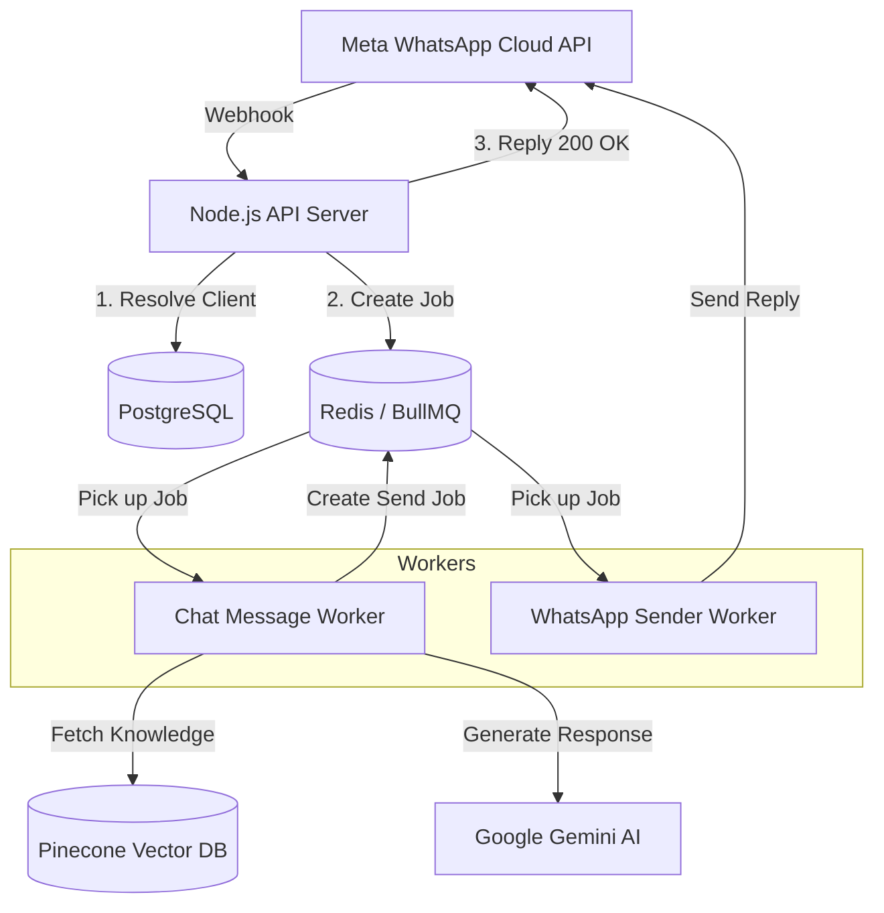

# 🏗️ WhatsApp AI Architecture

This document describes the high-level architecture and optimization strategies used in this multi-tenant WhatsApp AI platform.

## 🗺️ System Overview

The system uses a **Distributed Producer-Consumer Architecture** to ensure reliability and scalability.

---

## 🔑 Core Components

### 1. The Multi-Tenancy Engine
The application is a **Software as a Service (SaaS)** model. 
*   **Tenant Discovery**: Incoming messages are mapped to a `clientId` using the `phoneNumberId`.
*   **Credential Hot-Swapping**: The application dynamically loads the specific `whatsappToken` and `geminiApiKey` for the target client.
*   **Data Partitioning**: All database records and vector embeddings are namespaced by `clientId`.

### 2. Reliable Messaging (BullMQ)
We use **BullMQ** to separate the receiving of messages from the processing.
*   **Concurrency**: We can run 5+ workers to process AI responses simultaneously.
*   **Persistence**: If the AI is slow or the server crashes, messages stay safely in Redis until they are processed.
*   **Retry Logic**: Built-in exponential backoff handles temporary API failures (like Gemini 503s).

### 3. RAG Service (Knowledge Retrieval)
Retrieval-Augmented Generation (RAG) allows the bot to answer based on client-specific data.
*   **Vector Search**: We convert user queries into "embeddings" and search Pinecone.
*   **Namespace Isolation**: We use the `clientId` as a namespace, ensuring Client A never sees Client B's data.

---

## 🚀 Performance Optimizations

| Optimization | Technique | Benefit |
| :--- | :--- | :--- |
| **Idempotency** | Message ID tracking in Postgres | Prevents duplicate replies from Meta retries. |
| **Client Caching** | Node-Cache in memory | Reduces database load for tenant resolution. |
| **Connection Pooling** | Sequelize Connection Pool | Efficiently reuses database connections. |
| **Process Separation** | PM2/Docker worker scaling | Prevents AI processing from slowing down the API. |
| **Backoff Strategy** | Exponentially increasing delay | Maximizes success rate during AI service spikes (429/503). |

---

## 🛠️ Tech Stack
*   **Runtime**: Node.js (v20+)
*   **Database**: PostgreSQL (Persistence) & Redis (Queues)
*   **AI**: Google Gemini (LLM) & Pinecone (Vector DB)
*   **Infrastructure**: Docker & DigitalOcean
