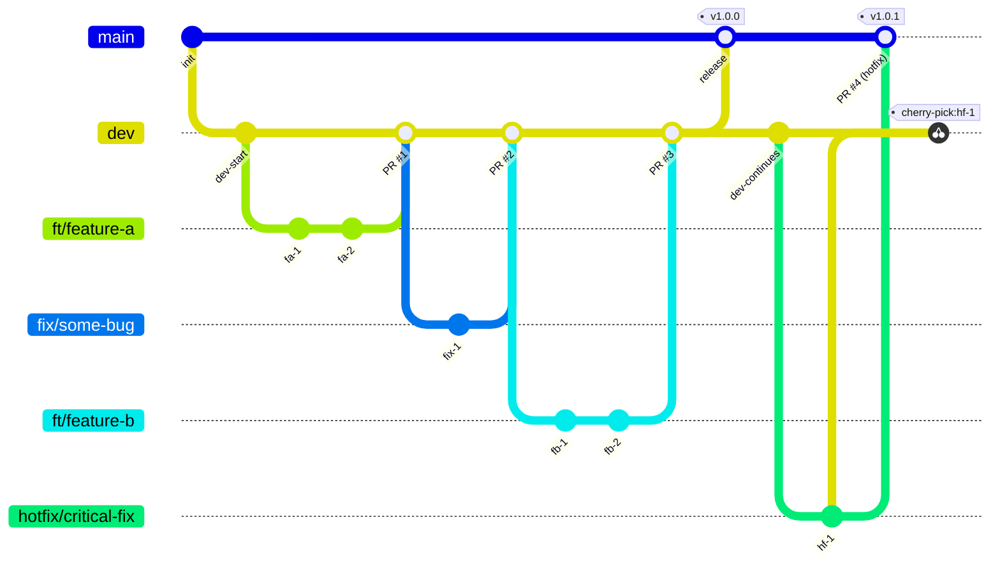

# Branching Strategy — Moyo Tech WhatsApp AI

## Branch Map



---

## Branch Naming Conventions

| Prefix | Purpose | Example |
|--------|---------|---------|
| `ft/` | New feature | `ft/multi-language-support` |
| `fix/` | Bug fix in development | `fix/double-message-send` |
| `hotfix/` | Urgent fix for production | `hotfix/payment-webhook-fail` |
| `ref/` | Refactoring (no new behaviour) | `ref/clean-up-auth-middleware` |
| `dev` | Integration branch — all work lands here first | — |
| `main` | Production — only merged into via PRs, never pushed to directly | — |

**Rules:**
- Use kebab-case after the prefix: `ft/some-feature`, not `ft/someFeature` or `ft/some_feature`
- Keep names short but descriptive — the branch name should explain the change
- Delete the branch after its PR is merged

---

## Permanent Branches

| Branch | Role | Who pushes? |
|--------|------|-------------|
| `main` | Production-ready code. Every merge triggers a deployment. | PRs only — never push directly |
| `dev` | Active development. All features and fixes land here before going to production. | PRs only |

---

## Workflows

### 1 — New Feature

```
main
 └── dev ──────────────────────────────────── PR ──▶ main
           └── ft/your-feature
                  commit, commit …
                  └── PR ──▶ dev
```

**Steps:**
1. `git checkout dev && git pull origin dev`
2. `git checkout -b ft/your-feature-name`
3. Work and commit: `git commit -m "feat: describe what you built"`
4. Push: `git push origin ft/your-feature-name`
5. Open a **Pull Request → `dev`** on GitHub
6. Request a review, address feedback, then merge
7. Delete the branch after merge

---

### 2 — Bug Fix (non-urgent, found during development)

```
main
 └── dev ──────────────────────────────────── PR ──▶ main
           └── fix/bug-description
                  commit …
                  └── PR ──▶ dev
```

**Steps:**
1. `git checkout dev && git pull origin dev`
2. `git checkout -b fix/describe-the-bug`
3. Fix and commit: `git commit -m "fix: describe what was broken and how you fixed it"`
4. Push and open **PR → `dev`**
5. Merge and delete branch

---

### 3 — Hotfix (urgent — production is broken)

A hotfix bypasses `dev` and goes **directly to `main`**, then is synced back to `dev` via cherry-pick so `dev` does not fall behind.

```
main ──────────────────────── PR ──▶ main (v1.0.1)
       └── hotfix/issue             │
              commit                └── cherry-pick ──▶ dev
```

**Steps:**
1. `git checkout main && git pull origin main`
2. `git checkout -b hotfix/describe-the-issue`
3. Fix and commit: `git commit -m "hotfix: describe the production issue and fix"`
4. Push and open **PR → `main`**
5. After merge, **also cherry-pick the fix commit into `dev`**:
   ```
   git checkout dev
   git cherry-pick <commit-hash>
   git push origin dev
   ```
6. Tag the release on `main`: `git tag v1.0.1`

---

### 4 — Release (promoting `dev` to production)

When `dev` is stable and ready to ship:

1. Open a **Pull Request: `dev` → `main`** on GitHub
2. Title it: `release: vX.Y.Z — short description`
3. After review and merge, tag the commit on `main`:
   ```
   git tag -a vX.Y.Z -m "Release vX.Y.Z"
   git push origin vX.Y.Z
   ```

---

## Commit Message Format

Follow [Conventional Commits](https://www.conventionalcommits.org/):

```
<type>: <short description>
```

| Type | When to use |
|------|-------------|
| `feat` | New feature |
| `fix` | Bug fix |
| `hotfix` | Production emergency fix |
| `refactor` | Code change with no behaviour change |
| `chore` | Tooling, deps, config |
| `docs` | Documentation only |
| `test` | Tests |

**Examples:**
```
feat: add multi-language detection to WhatsApp handler
fix: prevent duplicate messages when webhook fires twice
hotfix: payment webhook failing on missing meta field
refactor: extract RLS middleware into separate module
chore: upgrade Sequelize to 6.37.7
```

---

## Golden Rules

1. **Never push directly to `main` or `dev`** — all changes go through a Pull Request
2. **One branch = one concern** — do not mix a feature and a bug fix in the same branch
3. **Keep branches short-lived** — the longer a branch lives, the harder it is to merge
4. **Hotfixes always backport to `dev`** — use cherry-pick immediately after merging to `main`
5. **Delete branches after merge** — keeps the repo clean; GitHub can restore if needed
